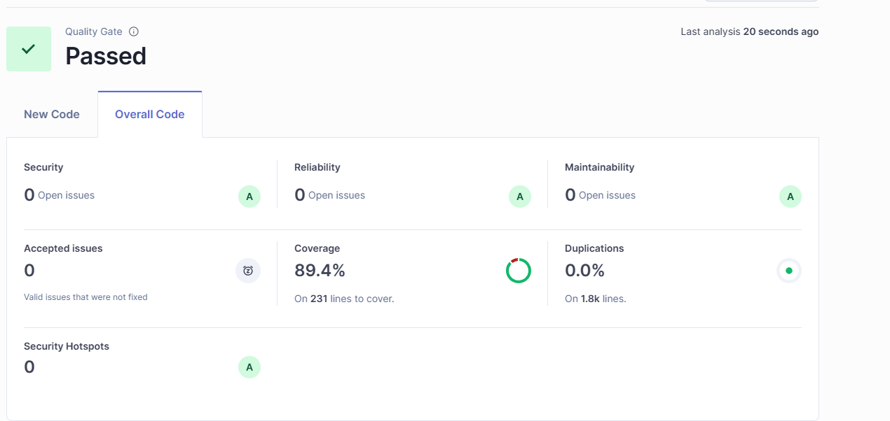

# Pokemon SOAP Service

A production-ready SOAP web service that acts as a gateway between SOAP clients and the PokeAPI REST API, built with hexagonal architecture and comprehensive testing (89.4% coverage).

## 📋 Introduction

This service exposes 6 SOAP operations to query Pokemon information:

- **GetPokemonAbilities** - Retrieve Pokemon abilities
- **GetPokemonBaseExperience** - Query base experience points
- **GetPokemonHeldItems** - List held items
- **GetPokemonId** - Get Pokemon ID
- **GetPokemonName** - Get Pokemon name
- **GetPokemonLocationAreaEncounters** - Query location encounters

**Flow**: SOAP Request (XML) → Service → PokeAPI (REST) → Transform → SOAP Response (XML)

## 🛠️ Technologies

### Core Stack
- **Java 21** - Programming language
- **Spring Boot 3.5.6** - Application framework
- **Gradle 8.x** - Build tool with wrapper

### SOAP & XML
- **Spring Web Services** - SOAP framework
- **JAXB 4.0.4** - XML marshalling/unmarshalling
- **WSDL4J 1.6.3** - WSDL auto-generation
- **XJC Plugin 1.8.2** - Generate Java classes from XSD

### Data & Client
- **Spring WebFlux** - Reactive HTTP client (WebClient)
- **MapStruct 1.6.3** - DTO mapping
- **Caffeine 3.1.8** - Caching layer

### Persistence & Logging
- **PostgreSQL 15** - Database
- **Spring Data JPA** - Repository layer
- **Log4j2** - Structured logging with multiple appenders

### Testing & Quality
- **JUnit 5** - Unit testing
- **Mockito** - Mocking framework
- **Cucumber 7.18.1** - BDD integration tests
- **JaCoCo 0.8.14** - Code coverage (89.4%)
- **SonarQube 7.0.0** - Code quality analysis

### Documentation & Monitoring
- **Springdoc OpenAPI 2.8.13** - Swagger UI
- **Spring Actuator** - Health checks & metrics

### DevOps
- **Docker & Docker Compose** - Containerization
- **Spring DevTools** - Hot reload in development

## 🏗️ Architecture

Hexagonal Architecture (Ports & Adapters) with clean separation of concerns:

```
src/main/java/com/bankaya/pokemon/
├── application/          # Application Layer
│   └── service/         # Use cases & orchestration
├── domain/              # Domain Layer (Business Logic)
│   ├── model/          # Domain entities (Java Records)
│   └── ports/          # Interfaces
│       ├── in/        # Input ports (use cases)
│       └── out/       # Output ports (repositories, APIs)
└── infrastructure/      # Infrastructure Layer
    ├── adapter/
    │   ├── persistence/  # JPA/PostgreSQL adapter
    │   ├── rest/        # PokeAPI REST client
    │   └── soap/        # SOAP endpoints
    ├── config/          # Spring configurations
    └── interceptor/     # SOAP audit interceptor
```

**Key Principles:**
- ✅ Dependency Inversion (Domain doesn't depend on infrastructure)
- ✅ Single Responsibility (Each layer has one purpose)
- ✅ Ports & Adapters (Interfaces decouple logic from implementation)

## 📝 Examples

### SOAP Request Example

**Endpoint**: `http://localhost:8080/pokemon/ws`
**WSDL**: `http://localhost:8080/pokemon/ws/pokemon.wsdl`

Using **curl**:

```bash
curl -X POST http://localhost:8080/pokemon/ws \
  -H "Content-Type: text/xml" \
  -d '<soapenv:Envelope xmlns:soapenv="http://schemas.xmlsoap.org/soap/envelope/"
                        xmlns:soap="http://bankaya.com/pokemon/soap">
   <soapenv:Body>
      <soap:GetPokemonAbilitiesRequest>
         <soap:name>pikachu</soap:name>
      </soap:GetPokemonAbilitiesRequest>
   </soapenv:Body>
</soapenv:Envelope>'
```

**Response**:
```xml
<SOAP-ENV:Envelope xmlns:SOAP-ENV="http://schemas.xmlsoap.org/soap/envelope/">
   <SOAP-ENV:Body>
      <ns2:GetPokemonAbilitiesResponse xmlns:ns2="http://bankaya.com/pokemon/soap">
         <ns2:abilities>
            <ns2:name>static</ns2:name>
            <ns2:url>https://pokeapi.co/api/v2/ability/9/</ns2:url>
            <ns2:hidden>false</ns2:hidden>
            <ns2:slot>1</ns2:slot>
         </ns2:abilities>
         <ns2:abilities>
            <ns2:name>lightning-rod</ns2:name>
            <ns2:url>https://pokeapi.co/api/v2/ability/31/</ns2:url>
            <ns2:hidden>true</ns2:hidden>
            <ns2:slot>3</ns2:slot>
         </ns2:abilities>
      </ns2:GetPokemonAbilitiesResponse>
   </SOAP-ENV:Body>
</SOAP-ENV:Envelope>
```

### REST Endpoint (Testing)

```bash
# Get complete Pokemon data as JSON
curl http://localhost:8080/pokemon/pikachu
```

### Swagger UI

Interactive API documentation available at:
```
http://localhost:8080/swagger-ui.html
```

## 🚀 How to Run

### Prerequisites

- **Java 21+**
- **Docker & Docker Compose**

### Setup

1. **Clone the repository**
   ```bash
   git clone https://github.com/UnderskinGarcia/pokemon-soap-service.git
   cd pokemon-soap-service
   ```

2. **Configure environment variables**
   ```bash
   cp .env.example .env
   # Edit .env with your settings (optional for Docker)
   ```

### Option 1: Docker

```bash
# Start all services (app + postgres + sonarqube)
docker-compose up -d

# Check services status
docker-compose ps

# Stop services
docker-compose down

# Clean shutdown (remove volumes)
docker-compose down -v
```

**Services available:**
- **SOAP Service**: http://localhost:8080/pokemon/ws
- **WSDL**: http://localhost:8080/pokemon/ws/pokemon.wsdl
- **Swagger**: http://localhost:8080/swagger-ui.html
- **Health Check**: http://localhost:8080/actuator/health
- **PostgreSQL**: localhost:5432
- **SonarQube**: http://localhost:9000

### Option 2: Local

**Set environment variables** (Linux/Mac):
```bash
export POSTGRES_HOST=localhost
export POSTGRES_PORT=5432
export POSTGRES_DB=pokemondb
export POSTGRES_USER=pokemon
export POSTGRES_PASSWORD=change_this_password
export SPRING_PROFILES_ACTIVE=dev
```

**Set environment variables** (Windows PowerShell):
```powershell
$env:POSTGRES_HOST="localhost"
$env:POSTGRES_PORT="5432"
$env:POSTGRES_DB="pokemondb"
$env:POSTGRES_USER="pokemon"
$env:POSTGRES_PASSWORD="change_this_password"
$env:SPRING_PROFILES_ACTIVE="dev"
```

**Run the application**:
```bash
# Using Gradle wrapper
./gradlew bootRun

# Or build and run JAR
./gradlew build
java -jar build/libs/pokemon-soap-service-0.0.1-SNAPSHOT.jar
```

## 📊 Logs

### Local Environment

Log files are located in `logs/` directory:

```bash
# Application logs (general)
tail -f logs/pokemon-service.log

# Database operations
tail -f logs/database.log

# Performance metrics (WebClient, Reactor)
tail -f logs/performance.log

# SOAP requests/responses audit
tail -f logs/soap-requests.log

# Errors only
tail -f logs/pokemon-service-error.log
```

### Docker Environment

**View logs from containers**:

```bash
# Follow all service logs
docker-compose logs -f pokemon-service

# View specific log file inside container
docker exec pokemon-service sh -c "cat /app/logs/pokemon-service.log"
docker exec pokemon-service sh -c "cat /app/logs/database.log"
docker exec pokemon-service sh -c "cat /app/logs/performance.log"
docker exec pokemon-service sh -c "cat /app/logs/soap-requests.log"

# Follow logs in real-time
docker exec pokemon-service sh -c "tail -f /app/logs/database.log"
docker exec pokemon-service sh -c "tail -f /app/logs/soap-requests.log"

# Filter by log level
docker-compose logs pokemon-service | grep ERROR
docker-compose logs pokemon-service | grep WARN
```

**Log files retention**:
- `pokemon-service.log`: 30 days
- `database.log`: 7 days
- `performance.log`: 15 days
- `soap-requests.log`: 15 days

## 🔍 SonarQube Analysis

### How to Run

**Option 1: Using custom Gradle task**
```bash
# Run tests + coverage + SonarQube analysis
./gradlew clean analyze
```

**Option 2: Step by step**
```bash
# 1. Run tests and generate coverage report
./gradlew clean test jacocoTestReport

# 2. Send analysis to SonarQube
./gradlew sonar
```

### View Results

1. **SonarQube Dashboard**: http://localhost:9000
   - Login: `admin` / `change_this_password`
   - Project: `pokemon-soap-service`

2. **Local JaCoCo Report**: `build/reports/jacoco/test/html/index.html`

3. **Latest Metrics Screenshot**

<p style="text-align: center;">
  
</p>

### Configuration

The SonarQube token is configured in `.env` file (not committed to git):

```properties
SONAR_TOKEN=your_token_here
```

To generate a new token:
1. Go to http://localhost:9000
2. Login → My Account → Security → Generate Token
3. Copy the token and update `.env`

**Current Quality Metrics** (see `docs/sonar/sonar.png`):
- ✅ **Coverage**: 89.4%
- ✅ **Unit Tests**: All passing
- ✅ **BDD Tests**: 4 Cucumber feature files
- ✅ **Code Smells**: 0
- ✅ **Technical Debt**: Low

## 🧪 Testing

```bash
# Run all tests (unit + integration)
./gradlew test

# Run only unit tests
./gradlew test --tests "*Test"

# Run only Cucumber/BDD tests
./gradlew test --tests "*CucumberRunnerTest"

# Run with coverage report
./gradlew test jacocoTestReport

# View coverage report
open build/reports/jacoco/test/html/index.html
```

**Test Structure**:
- **Unit Tests** (89.4% coverage)
  - `PokeApiClientTest` - REST client tests
  - `SoapAuditInterceptorTest` - SOAP audit tests
  - `SoapAuditServiceTest` - Async service tests

- **BDD/Cucumber Tests** (4 feature files)
  - `actuator.feature` - Health checks
  - `pokemon-endpoint.feature` - SOAP operations
  - `pokemon-rest-controller.feature` - REST endpoints
  - `soap-proxy-controller.feature` - SOAP proxy

## 📦 Build & Deploy

```bash
# Build without tests
./gradlew build -x test

# Build with tests
./gradlew clean build

# Create Docker image
docker build -t pokemon-soap-service:latest .

# Deploy with Docker Compose
docker-compose up -d
```

## 🔧 Troubleshooting

**Port 8080 already in use**:
```bash
# Edit .env and change port mapping
DOCKER_APP_PORTS=9090:8080
# Restart: docker-compose down && docker-compose up -d
```

**PostgreSQL connection issues**:
```bash
# Check database is running
docker-compose ps postgres

# Connect to database
docker-compose exec postgres psql -U pokemon -d pokemondb
```

**Gradle issues**:
```bash
# Clean cache
./gradlew clean

# Refresh dependencies
./gradlew build --refresh-dependencies
```

## 📄 API Documentation

| Endpoint | Type | Description |
|----------|------|-------------|
| `/pokemon/ws` | SOAP | Main SOAP endpoint (6 operations) |
| `/pokemon/ws/pokemon.wsdl` | WSDL | Service contract |
| `/pokemon/{name}` | REST | Get Pokemon data (JSON) |
| `/swagger-ui.html` | Docs | Interactive API documentation |
| `/actuator/health` | Health | Service health check |

## 🏆 Quality Metrics

- **Test Coverage**: 89.4% (JaCoCo)
- **Unit Tests**: All tests passing
- **Integration Tests**: 4 BDD feature files (Cucumber)
- **Code Quality**: Monitored with SonarQube
- **Architecture**: Hexagonal (Ports & Adapters)
- **Code Style**: MapStruct, Lombok, Java 21 Records

## What can be improved?

 - Update the generic http code response (500) with codes more appropriate to the use case.
 - Swagger rest proxy was the best solution I could come up with.
 - Add more tests to cover 100% of the code.

## 📞 Contact

- **GitHub**: [UnderskinGarcia](https://github.com/UnderskinGarcia)
- **Repository**: [pokemon-soap-service](https://github.com/UnderskinGarcia/pokemon-soap-service)

---

**Version**: 0.0.1-SNAPSHOT
**Java**: 21
**Spring Boot**: 3.5.6
**Last Updated**: 2025
